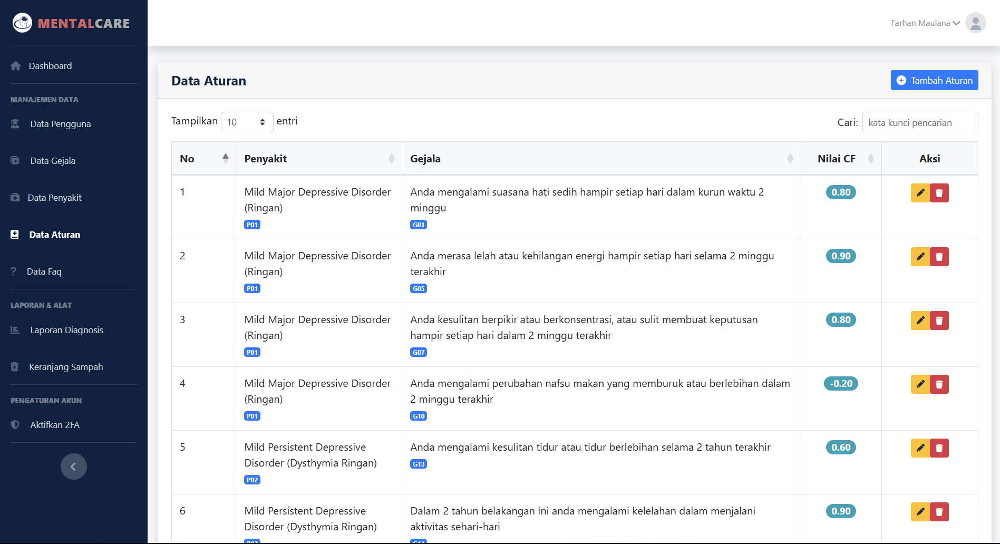

# MentalCare

## 📖 Tentang MentalCare

MentalCare adalah aplikasi sistem pakar berbasis web yang dirancang untuk membantu mendiagnosis tingkat depresi, khususnya bagi kalangan usia produktif. Aplikasi ini memanfaatkan metode perhitungan **Certainty Factor** dengan basis pengetahuan yang divalidasi oleh pakar psikologi untuk memberikan hasil diagnosis yang akurat beserta rekomendasi penanganan awal.

Tujuan utama proyek ini adalah menyediakan alat bantu yang mudah diakses untuk meningkatkan kesadaran akan kesehatan mental dan mendorong pengguna untuk mencari bantuan profesional jika diperlukan.

---

## 🚀 Teknologi yang Digunakan

Proyek ini dibangun menggunakan tumpukan teknologi modern dan andal:

-   **Framework Backend**: [CodeIgniter 4](https://codeigniter.com/)
-   **Framework Frontend**: [Bootstrap 5](https://getbootstrap.com/)
-   **Template**: 
    -   [SB Admin 2](https://startbootstrap.com/theme/sb-admin-2) untuk Dasbor Admin.
    -   [Arsha](https://bootstrapmade.com/arsha-free-bootstrap-html-template-corporate/) untuk Landing Page.
-   **Library Pihak Ketiga**:
    -   `PHPMailer`: Untuk fungsionalitas pengiriman email (OTP & Token).
    -   `Google API Client`: Untuk fitur "Login with Google" (OAuth2).
    -   `Dompdf`: Untuk mengunduh hasil diagnosis dalam format PDF.
    -   `PHPOffice/PhpSpreadsheet`: Untuk mengunduh laporan dalam format Excel.

---

## ✨ Fitur Utama

### Untuk Pengguna (Pasien)
-   **Landing Page Informatif**: Halaman utama dengan informasi tentang aplikasi dan FAQ.
-   **Proses Diagnosis Interaktif**:
    -   Pengisian biodata pengguna.
    -   Kuesioner gejala yang mudah dipahami.
-   **Hasil Diagnosis Komprehensif**:
    -   Visualisasi nilai Certainty Factor (CF) dan persentase tingkat depresi.
    -   Detail perhitungan untuk transparansi.
    -   Deskripsi kondisi dan solusi penanganan awal.
    -   Opsi untuk mengunduh hasil diagnosis dalam format **PDF**.
-   **Manajemen Akun**:
    -   Registrasi aman dengan **verifikasi OTP** via email.
    -   Login menggunakan email & password terenkripsi.
    -   Fitur **Lupa Password** dengan token reset via email.
    -   Kemudahan login dengan **Akun Google (OAuth2)**.

### Untuk Admin
-   **Dasbor Admin**: Tampilan ringkas untuk memantau aktivitas sistem.
-   **Manajemen Data Master**:
    -   CRUD (Create, Read, Update, Delete) untuk data **Gejala**, **Penyakit**, dan **FAQ**.
-   **Manajemen Aturan (Rule)**:
    -   Mengatur nilai pakar (MB & MD) untuk setiap aturan diagnosis.
    -   Nilai CF Pakar dihitung secara otomatis.
-   **Laporan Diagnosis**:
    -   Melihat seluruh riwayat diagnosis pengguna.
    -   Fitur **Truncate** untuk membersihkan data.
    -   Opsi unduh laporan dalam format **PDF** dan **Excel**.
    -   Mencetak laporan langsung dari browser.
-   **Manajemen Pengguna**: Mengelola akun Admin dan Pengguna terdaftar.

---

## 🛠️ Panduan Instalasi Lengkap

Ikuti langkah-langkah berikut untuk menjalankan proyek ini di lingkungan pengembangan lokal Anda.

### 1. Persyaratan Sistem (Prerequisites)

Pastikan sistem Anda telah memenuhi semua persyaratan di bawah ini:

-   **Web Server**: [Laragon](https://laragon.org/download/) (direkomendasikan) atau sejenisnya (XAMPP/WAMP/MAMP) dengan **PHP v7.4 atau lebih baru**.
-   **PHP Extension**: Aktifkan ekstensi `intl`.
    -   **Cara Aktivasi di Laragon**: Klik kanan ikon Laragon di system tray > PHP > php.ini, cari baris `;extension=intl`, hapus titik koma (`;`) di awal baris, simpan file, dan restart Laragon.
-   **Dependency Manager**: [Composer](https://getcomposer.org/) versi terbaru.

### 2. Langkah-langkah Instalasi

1.  **Clone Repositori**
    -   Buka terminal/CMD, arahkan ke direktori web server Laragon Anda (biasanya di `C:\laragon\www`), lalu jalankan perintah:
      ```bash
      git clone https://github.com/8farhanma/MentalCare.git
      ```
    -   Atau unduh file ZIP dan ekstrak ke `htdocs`.

2.  **Konfigurasi Environment**
    -   Di dalam direktori proyek, salin file `env example` dan ganti namanya menjadi `.env`.
    -   Buka file `.env` menggunakan teks editor dan atur koneksi database Anda.
      ```dotenv
      # file: .env
      
      database.default.hostname = localhost
      database.default.database = mentalcare_db  # Ganti jika perlu
      database.default.username = root          # Ganti dengan username DB Anda
      database.default.password =               # Ganti dengan password DB Anda
      database.default.DBDriver = MySQLi
      ```

3.  **Konfigurasi URL Aplikasi**
    -   **Opsi 1: Menggunakan PHP Built-in Server**
        -   Tidak perlu mengubah konfigurasi URL
        -   Aplikasi akan berjalan di `http://localhost:8080`
    
    -   **Opsi 2: Menggunakan Web Server (Apache/Nginx)**
        -   Buka file `app/Config/App.php`
        -   Ubah `baseURL` sesuai dengan alamat folder proyek Anda (pastikan diakhiri dengan `/public/`):
        ```php
        // file: app/Config/App.php
        public string $baseURL = 'http://localhost/MentalCare/public/';
        ```

4.  **Install Dependensi**
    -   Arahkan terminal Anda ke direktori root proyek (`cd C:\laragon\www\MentalCare`).
    -   Jalankan perintah berikut untuk menginstal semua library yang dibutuhkan:
      ```bash
      composer install
      ```

5.  **Setup Database**
    -   Buka **phpMyAdmin** (`http://localhost/phpmyadmin`).
    -   Buat database baru dengan nama yang sama seperti yang Anda atur di file `.env` (contoh: `mentalcare`).

6.  **Jalankan Migrasi & Seeder**
    -   Kembali ke terminal Anda, jalankan perintah migrasi untuk membuat struktur tabel:
      ```bash
      php spark migrate --all
      ```
    -   (Opsional tapi direkomendasikan) Jalankan seeder untuk mengisi data awal (admin, gejala, penyakit):
      ```bash
      php spark db:seed --all
      ```

7.  **Jalankan Aplikasi**
    -   **Opsi 1: Menggunakan PHP Built-in Server**
        -   Jalankan perintah berikut di terminal:
          ```bash
          php spark serve
          ```
        -   Buka browser dan akses: `http://localhost:8080`
    
    -   **Opsi 2: Menggunakan Web Server**
        -   Pastikan web server (Apache/Nginx) sudah berjalan
        -   Buka browser dan akses URL yang telah Anda konfigurasikan: `http://localhost/MentalCare/public/`
    
    -   **Login Admin**: Kredensial login admin default dapat dilihat di file `app/Database/Seeds/AdminSeeder.php`.

---

## 📸 Screenshot Website

### Halaman Depan (Landing Page)

*Tampilan halaman depan aplikasi MentalCare*  
*Deskripsi: Menampilkan informasi tentang aplikasi dan fitur-fitur utamanya.*

### Halaman Login

*Halaman login dengan opsi login manual dan Google*  
*Deskripsi: Pengguna dapat login menggunakan email/password atau akun Google.*

### Form Diagnosis


*Form pengisian kuesioner diagnosis*  
*Deskripsi: Pengguna mengisi kuesioner untuk mendapatkan diagnosis awal.*

### Hasil Diagnosis


*Halaman hasil diagnosis*  
*Deskripsi: Menampilkan hasil diagnosis beserta penjelasan dan rekomendasi.*

### MentalBot

*Halaman MentalBot*  
*Deskripsi: Menampilkan MentalBot yang dapat membantu pengguna dalam mendapatkan informasi tentang kesehatan mental.*

### Dashboard Admin

*Tampilan dashboard admin*  
*Deskripsi: Menampilkan ringkasan statistik dan navigasi ke berbagai fitur admin.*

### Manajemen Data Diagnosis Master 



*Halaman manajemen data master*  
*Deskripsi: Admin dapat mengelola data gejala, penyakit, dan aturan diagnosis.*

---

## 🔧 Konfigurasi Tambahan (Opsional)

### Mengaktifkan Login dengan Google

1.  Buka [Google Cloud Console](https://console.cloud.google.com/apis/credentials) dan buat proyek baru.
2.  Buat **OAuth client ID**. Pilih "Web application" sebagai tipe aplikasi.
3.  Pada bagian **Authorized redirect URIs**, tambahkan URL berikut:
    ```
    http://localhost/MentalCare/public/login-google/callback
    ```
4.  Salin **Client ID** dan **Client Secret** yang Anda dapatkan.
5.  Buka file `app/Controllers/Auth.php`, cari fungsi `initializeGoogleClient()`, dan masukkan kredensial Anda.
    ```php
    // file: app/Controllers/Auth.php

    private function initializeGoogleClient()
    {
        $client = new Google_Client();
        $client->setClientId('MASUKKAN_CLIENT_ID_ANDA_DISINI');
        $client->setClientSecret('MASUKKAN_CLIENT_SECRET_ANDA_DISINI');
        $client->setRedirectUri(base_url('login-google/callback'));
        $client->addScope('email');
        $client->addScope('profile');
        return $client;
    }
    
- jika anda melakukan semua itu dengan benar, maka login with google akan bisa digunakan tanpa kendala.

Jika anda ingin mengaktifkan *Send Email OTP - Kritik dan Saran Email - Token Lupa Password* anda wajib melakukan konfigurasi terhadap email yang akan anda gunakan juga
- pertama, anda harus mengkonfigurasi authenticated 2 langkah pada email yang ingin anda gunakan sebagai send OTP email dll
- kedua, jika sudah maka anda akan diberikan password dalam bentuk acak yang nantinya kita gunakan.
- ketiga, jika anda ingin mengkonfigurasi *Send OTP Email* maka anda buka ``app/Config/Controllers/RegisterController`` dan ubah bagian:
```code
        $mail = new PHPMailer();
        $mail->isSMTP();
        $mail->Host = 'smtp.gmail.com';
        $mail->SMTPAuth = true;
        $mail->Username = 'MASUKKAN EMAIL ANDA DISINI';
        $mail->Password = 'MASUKKAN PASSWORD AUTHENTICATED 2 LANGKAH DISINI';
        $mail->SMTPSecure = 'tls';
        $mail->Port = 587;

        // Recipients
        $mail->setFrom('MASUKKAN EMAIL ANDA DISINI', 'MentalCare');
        $mail->addAddress($email);
```

---

## Hak Cipta (Copyright)

 2025 Farhan Maulana. Seluruh hak cipta dilindungi.

Aplikasi MentalCare dan kode sumbernya dilisensikan di bawah [MIT License](LICENSE).

**Dibuat dengan ❤️ oleh Farhan Maulana**  
8farhanmaulana@gmail.com  
https://github.com/8farhanma

### Penggunaan dan Distribusi
- Dilarang keras untuk mengklaim aplikasi ini sebagai milik Anda sendiri
- Diperbolehkan untuk digunakan sebagai referensi belajar dengan mencantumkan sumber
- Untuk penggunaan komersial, silakan hubungi pemilik hak cipta terlebih dahulu
